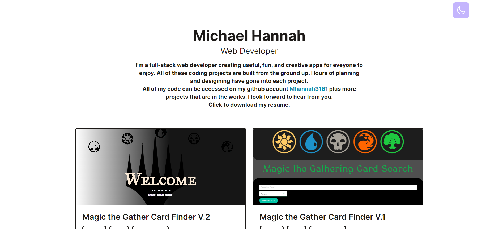

<div align="center">


  <h2 align="center">Michael hannah - Personal Portfolio</h2>

This website is fully responsive personal portfolio, <br />Responsive for all devices, built using JSX, Vite, and TailwindCSS.

<a href=""><strong>➥ Live Demo</strong></a>

</div>

<br />

### Demo Screeshots



### Prerequisites

Before you begin, ensure you have met the following requirements:

- [Git](https://git-scm.com/downloads "Download Git") must be installed on your operating system.

### Run Locally

To run **portfolio** locally, run this command on your git bash:

Linux and macOS:

```bash
sudo git clone https://github.com/mhannah3161/portfolio.git
```

Windows:

```bash
git clone https://github.com/mhannah3161/portfolio.git
```


### License

This project is **free to use** and does not contains any license.